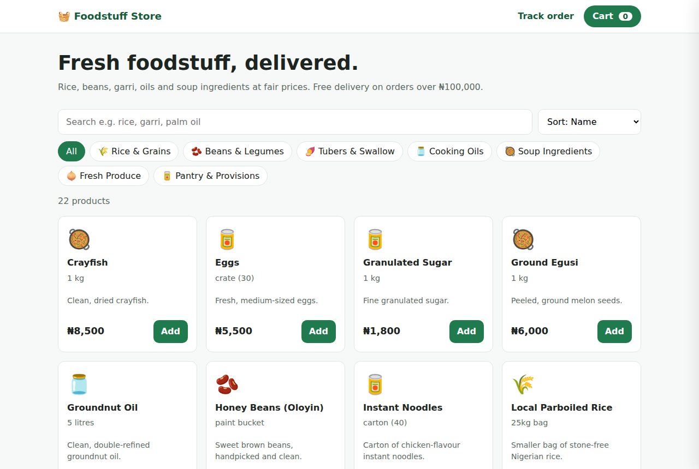
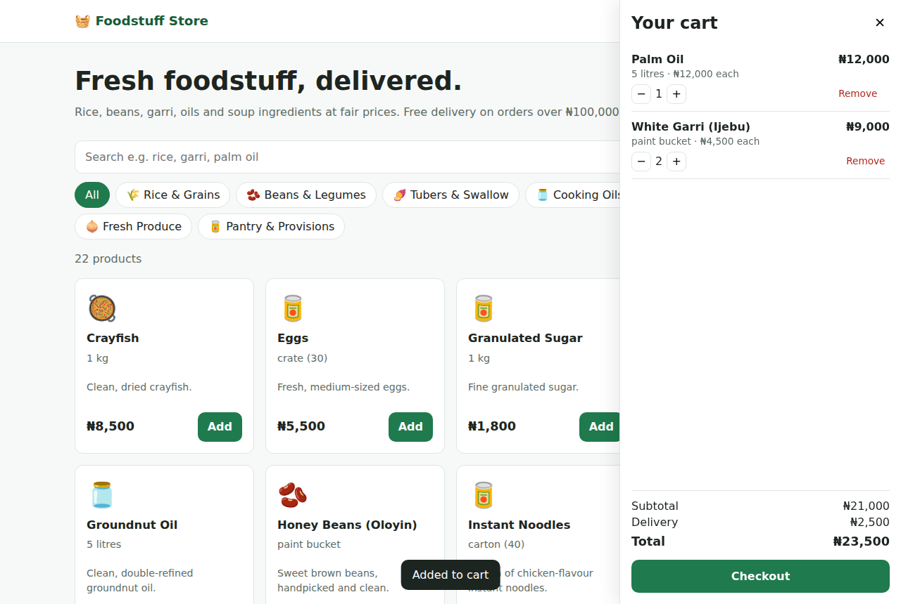
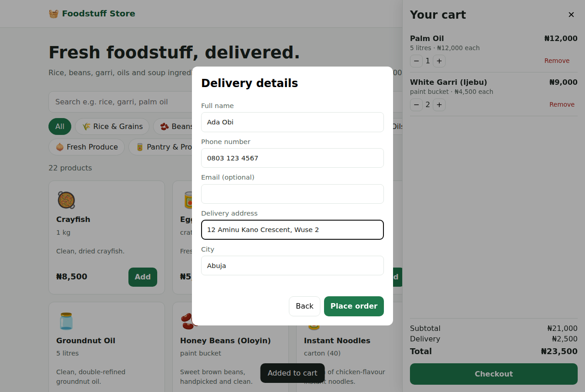
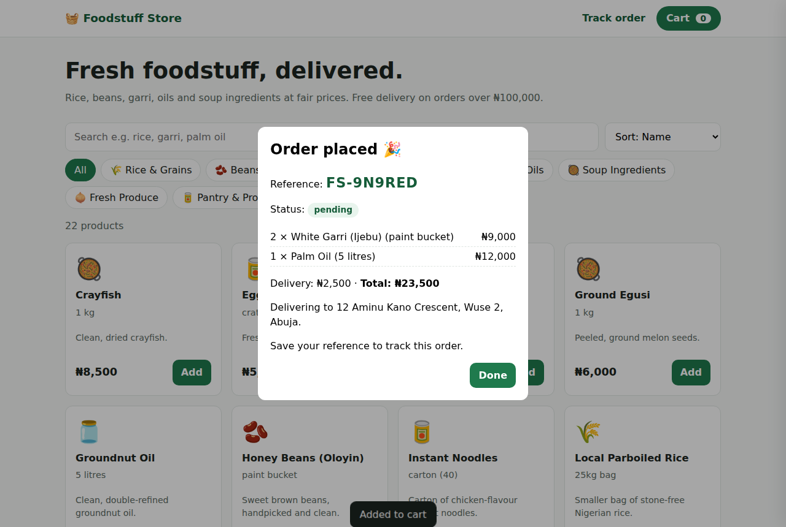
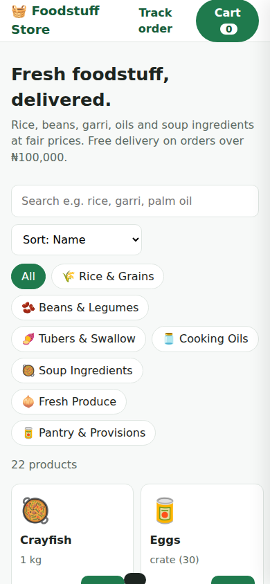

# 🧺 Foodstuff Store: Online Grocery API & Web Shop

A full-stack online foodstuff store built with **Node.js, Express and MySQL**. Customers can browse Nigerian foodstuffs, search and filter the catalogue, manage a cart, check out with delivery details and track their order. Admins can manage products and move orders through their delivery lifecycle.

> **Live demo:** [https://foodstuff-store.onrender.com](https://foodstuff-store.onrender.com) (free hosting, may take a minute to wake up) · **Tech:** Node.js 22, Express 5, MySQL 8, vanilla JavaScript, Jest, Docker, GitHub Actions



## Features

**Shop (customer)**
- Product catalogue with categories, search, sorting and pagination
- Cart that survives page reloads, with quantity controls and live totals
- Delivery fee logic: NGN 2,500 flat, **free on orders of NGN 100,000+**
- Checkout with validated delivery details (Nigerian phone numbers normalised to `+234…`)
- Order confirmation with a readable reference (e.g. `FS-9N9RED`) and order tracking by reference + phone
- Responsive layout that works on mobile

**Admin (API, protected by an API key)**
- Create, update, price and restock products; hide discontinued products
- List orders with status filters and pagination
- Move orders through `pending → confirmed → out_for_delivery → delivered`, or cancel. **Cancelling returns items to stock.**

**Engineering**
- **Safe checkout:** a single database transaction locks the product rows (`SELECT … FOR UPDATE`), re-checks stock, reduces it, creates the order and empties the cart. If anything fails, nothing is saved, so two customers can't buy the last bag of rice.
- **Money stored in kobo (integers)** to avoid floating-point rounding errors.
- **Price snapshots:** order items store the name and price at the time of purchase, so later price changes don't rewrite old orders.
- **Order status state machine:** invalid jumps (e.g. `pending → delivered`) are rejected.
- Input validation on every endpoint, consistent JSON error responses, security headers (Helmet), constant-time admin key comparison, and HTML escaping on the front end.
- **22 automated integration tests** (Jest + Supertest) against a real MySQL database, run on every push with GitHub Actions ([workflow](../.github/workflows/01-foodstuff-store-ci.yml)).

## Screenshots

| Cart | Checkout | Order confirmed | Mobile |
|---|---|---|---|
|  |  |  |  |

## Tech stack

| Layer | Technology |
|---|---|
| Runtime / framework | Node.js 22, Express 5 |
| Database | MySQL 8 (also tested on MariaDB 10.11) via `mysql2` connection pool |
| Front end | HTML, CSS, vanilla JavaScript (served by Express) |
| Testing | Jest, Supertest |
| DevOps | Docker, Docker Compose, GitHub Actions CI |
| Security | Helmet, input validation, API-key auth for admin routes |

## Project structure

```
├── db/
│   ├── schema.sql          # tables, keys, indexes
│   └── seed.sql            # 7 categories, 22 sample products
├── public/                 # web shop (index.html, styles.css, app.js)
├── scripts/initDb.js       # creates the database, tables and sample data
├── src/
│   ├── app.js              # Express app: middleware, routes, error handling
│   ├── server.js           # starts the HTTP server
│   ├── config/             # database pool, business settings
│   ├── middleware/         # admin auth, 404 + error handler
│   ├── models/             # SQL + business logic (products, carts, orders)
│   ├── routes/             # REST endpoints and request validation
│   └── utils/              # validators, errors, money helpers
├── tests/api.test.js       # integration tests
└── Dockerfile, docker-compose.yml
```

## API reference

Base URL: `/api`. All responses are JSON. Admin routes need the header `x-admin-key: <ADMIN_API_KEY>`.

| Method | Endpoint | Description |
|---|---|---|
| GET | `/health` | API and database status |
| GET | `/categories` | Categories with product counts |
| GET | `/products?category=&search=&sort=&page=&limit=&inStock=` | List products (`sort`: `name`, `price_asc`, `price_desc`, `newest`) |
| GET | `/products/:id` | Product details |
| POST | `/products` 🔒 | Create a product (`categoryId, name, unit, priceKobo, stock, description?`) |
| PATCH | `/products/:id` 🔒 | Update price, stock, details or `isActive` |
| POST | `/carts` | Create a cart, returns its `id` |
| GET | `/carts/:cartId` | Cart items, subtotal, delivery fee and total |
| POST | `/carts/:cartId/items` | Add an item `{ productId, quantity }` (checks stock) |
| PATCH | `/carts/:cartId/items/:productId` | Set quantity (`0` removes the item) |
| DELETE | `/carts/:cartId/items/:productId` | Remove an item |
| POST | `/orders` | Check out `{ cartId, customer: { name, phone, email?, address, city } }` |
| GET | `/orders/track/:reference?phone=` | Customer order tracking |
| GET | `/orders?status=&page=&limit=` 🔒 | List orders |
| GET | `/orders/:reference` 🔒 | Order details |
| PATCH | `/orders/:reference/status` 🔒 | Update status `{ status }` |

Example checkout:

```bash
curl -X POST http://localhost:3000/api/orders \
  -H "Content-Type: application/json" \
  -d '{"cartId":"<cart-id>","customer":{"name":"Ada Obi","phone":"08031234567","address":"12 Aminu Kano Crescent, Wuse 2","city":"Abuja"}}'
```

Errors use a consistent shape, e.g. `409 { "error": "Only 20 left in stock for Stockfish Pieces" }`.

## Getting started

### Option 1: Docker (easiest)

```bash
cd web-development-portfolio/01-foodstuff-store
docker compose up --build
```
Open http://localhost:3000. MySQL is created and seeded automatically.

### Option 2: Run locally

Requirements: Node.js 18+ and a MySQL 8 (or MariaDB 10.6+) server.

```bash
git clone https://github.com/oghenefavour/web-development-portfolio.git
cd web-development-portfolio/01-foodstuff-store
npm install
cp .env.example .env        # then set DB_USER, DB_PASSWORD and ADMIN_API_KEY
npm run db:init             # creates the database, tables and sample data
npm run dev                 # http://localhost:3000
```

### Running the tests

The tests build their own database (`foodstuff_store_test`), so they never touch your data.

```bash
npm test
```

## How I built it

I built this project using **AI-assisted development with Claude Code**: planning the data model and API, generating and reviewing code, and writing tests. Every part was reviewed, run and tested before being committed. Key decisions I made along the way:

- **Integers for money** after considering floating-point rounding on naira amounts.
- **Row locking in checkout** to prevent overselling when stock is low.
- **Integration tests against a real database** rather than mocks, so the SQL itself is tested.

## Possible next steps

- Customer accounts and login (JWT)
- Online payments (e.g. Paystack) with webhook verification
- Product images and an admin dashboard UI
- Rate limiting and request logging for production

## Author

**Favour Oghale**, B.Sc. Computer Science ([LinkedIn](https://www.linkedin.com/in/favour-oghale-8769a9283/) · [GitHub](https://github.com/oghenefavour))

Part of my [web development portfolio](../README.md). Licensed under the MIT License. Product prices in the sample data are illustrative only.
