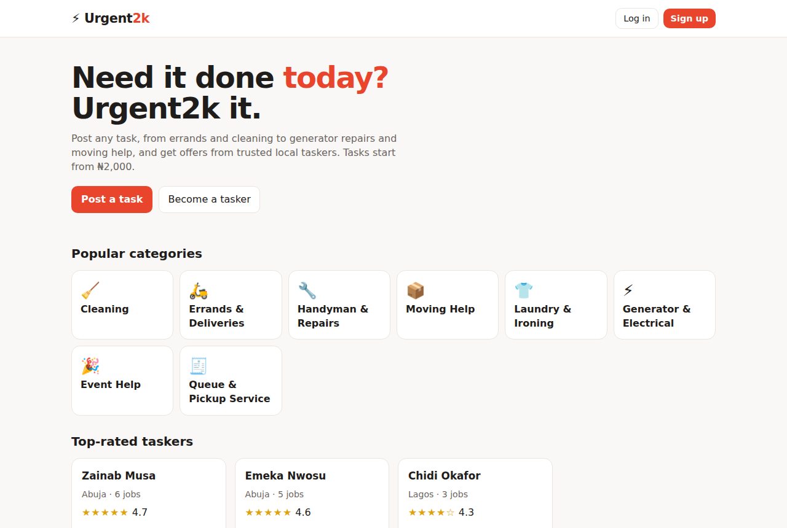
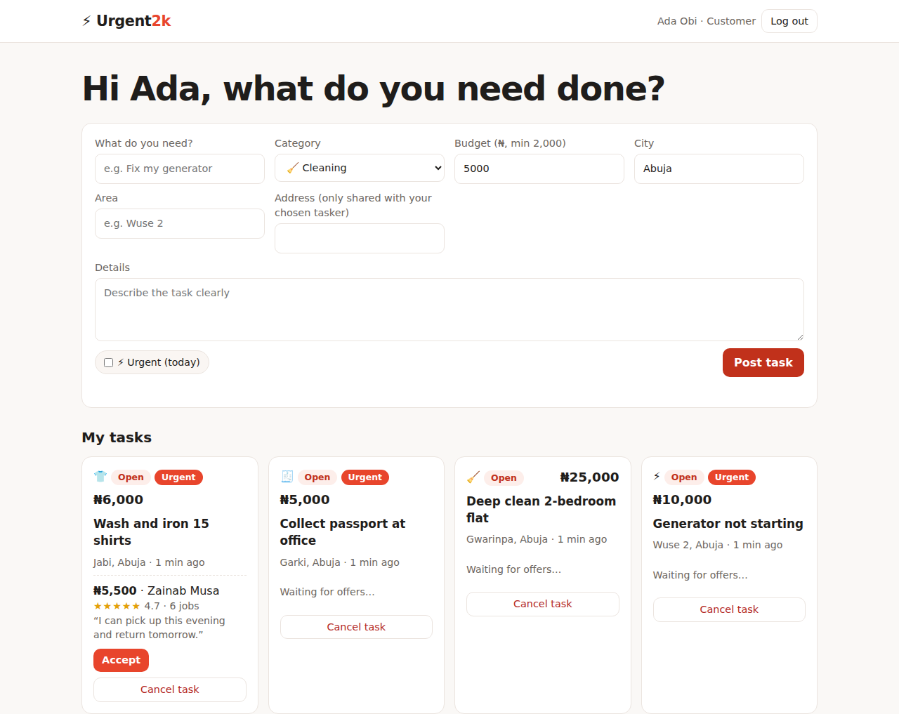
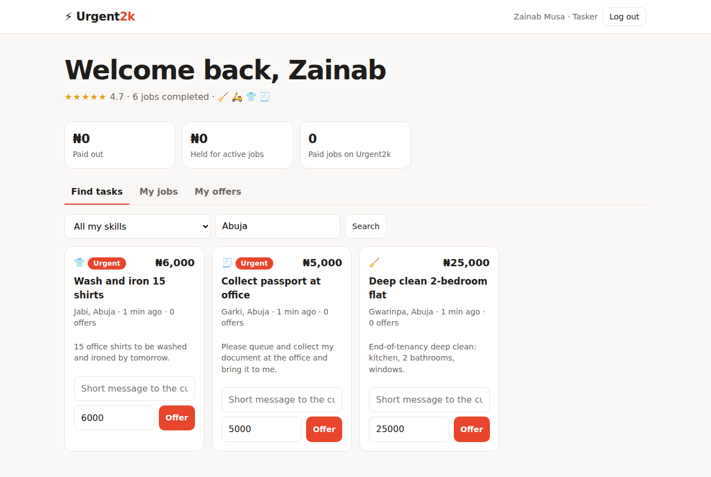
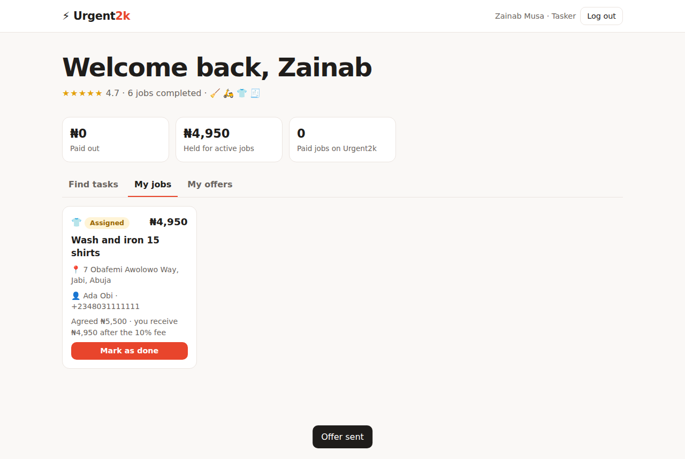
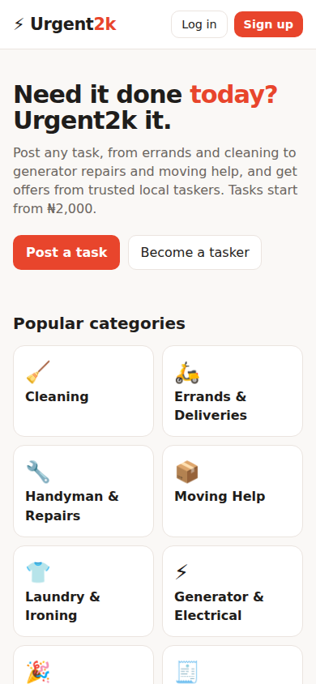

# ⚡ Urgent2k: Task Marketplace for Nigeria

**Need it done today? Urgent2k it.** Urgent2k connects people who need everyday tasks done (errands, cleaning, generator repairs, moving help, laundry, queueing) with trusted local **taskers**. Customers post a task with a budget from **₦2,000**, taskers send offers, and payment is held safely until the job is confirmed.

> **Live demo:** _add your deployed link here_ · Demo logins: `ada@demo.ng` (customer) or `zainab@demo.ng` (tasker), password `Password123!`



## Features

**Customers**
- Sign up and log in (JWT authentication, passwords hashed with bcrypt)
- Post tasks with category, area, budget (minimum ₦2,000) and an ⚡ urgent flag
- Compare offers with each tasker's price, star rating and completed jobs
- Accept an offer: the task is assigned, other offers are declined and **payment is held in escrow**
- Confirm the finished job and leave a 1–5 star review, which **releases payment** to the tasker
- Cancel before completion for an automatic **refund**

**Taskers**
- Sign up with skill categories and a short bio
- Browse open tasks filtered by skill and city (urgent tasks first)
- Send offers (only for tasks in their skills), withdraw and re-offer
- See the full address and customer phone **only after being hired**
- Mark jobs done and track earnings: paid out, held in escrow and platform fees

**Business rules**
- 10% platform fee deducted from the tasker's payout
- Status flow: `open → assigned → completed → confirmed` (or `cancelled`)
- Privacy by design: exact addresses and phone numbers are hidden until a tasker is hired, and tasker contact details are never public

## Screenshots

| Customer: compare offers | Tasker: find tasks | Tasker: active job | Mobile |
|---|---|---|---|
|  |  |  |  |

## Tech stack

Node.js 22 · Express 5 · MySQL 8 · JWT (jsonwebtoken) · bcryptjs · vanilla JavaScript · Jest + Supertest · Docker · GitHub Actions

## Engineering highlights

- **Role-based access control:** `requireAuth('customer')` / `requireAuth('tasker')` middleware guards every action, and ownership is checked in the data layer (you can only accept offers on your own task).
- **Transactions with row locks** for accepting offers, confirming jobs and cancelling, so two customers or double-clicks can't create inconsistent states.
- **Simulated escrow** (`payments` table: held → released / refunded) mirroring how a real payment provider such as Paystack would be integrated.
- **Money in kobo (integers)**, calculated fees and payouts stored on the task.
- **Security:** bcrypt password hashing, identical error messages for unknown email and wrong password, JWT expiry, Helmet headers, input validation on every endpoint, HTML escaping in the UI.
- **16 integration tests** against a real MySQL database covering sign-up, login, permissions, the full task journey, refunds and offer withdrawal.
- **Zero-setup hosting:** with `AUTO_INIT_DB=true` the app creates its tables and demo data on first start.

## API overview

| Method | Endpoint | Who | Purpose |
|---|---|---|---|
| POST | `/api/auth/register` | anyone | Create a customer or tasker account |
| POST | `/api/auth/login` | anyone | Log in, returns a JWT |
| GET | `/api/me` | logged in | Current user (taskers include rating and skills) |
| GET | `/api/categories` · `/api/taskers?category=&city=` | anyone | Browse categories and top taskers |
| POST | `/api/tasks` | customer | Post a task |
| GET | `/api/tasks/mine` | customer | My tasks |
| POST | `/api/tasks/:id/offers/:offerId/accept` | customer | Accept an offer (holds payment) |
| POST | `/api/tasks/:id/confirm` | customer | Confirm and review (releases payment) |
| POST | `/api/tasks/:id/cancel` | customer | Cancel (refunds if held) |
| GET | `/api/tasks?category=&city=` | logged in | Open tasks |
| GET | `/api/tasks/:id` | logged in | Task details (fields filtered by role) |
| POST | `/api/tasks/:id/offers` | tasker | Make an offer |
| GET | `/api/offers/mine` · POST `/api/offers/:id/withdraw` | tasker | My offers |
| GET | `/api/jobs/mine` · POST `/api/tasks/:id/complete` | tasker | My jobs |
| GET | `/api/earnings` | tasker | Earnings summary |

Send the token as `Authorization: Bearer <token>`.

## Run it locally

```bash
cd web-development-portfolio/02-urgent2k
npm install
cp .env.example .env      # set DB_USER / DB_PASSWORD
npm run dev               # creates the database on first start, then http://localhost:3000
```
Or with Docker: `docker compose up --build`. Run the tests with `npm test`.

## Built with

Built with **AI-assisted development (Claude Code)**, then reviewed, run and tested. Next steps would be real Paystack payments with webhooks, in-app chat, photo uploads for tasks, and tasker ID verification.

Part of my [web development portfolio](../README.md) · **Favour Oghale**
