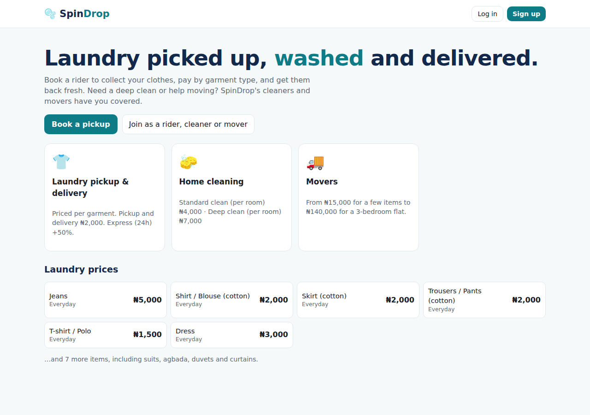
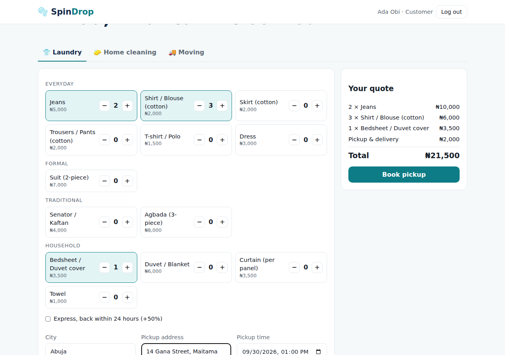
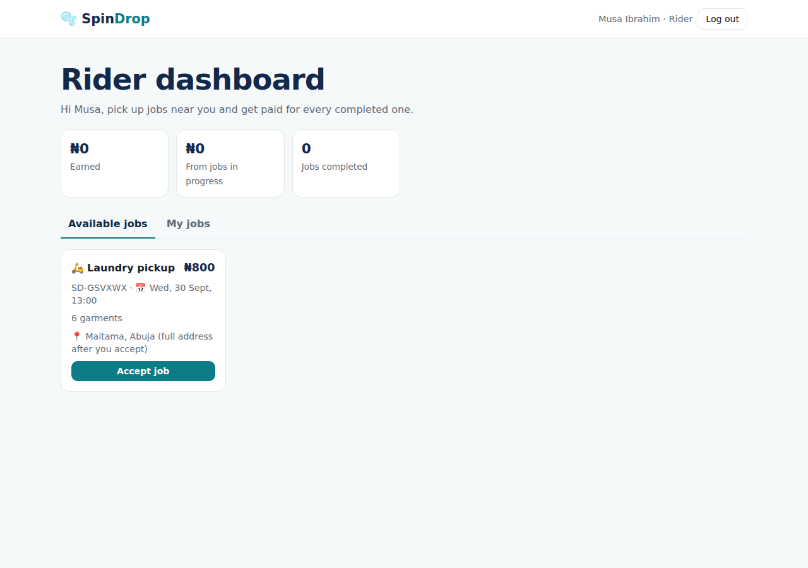
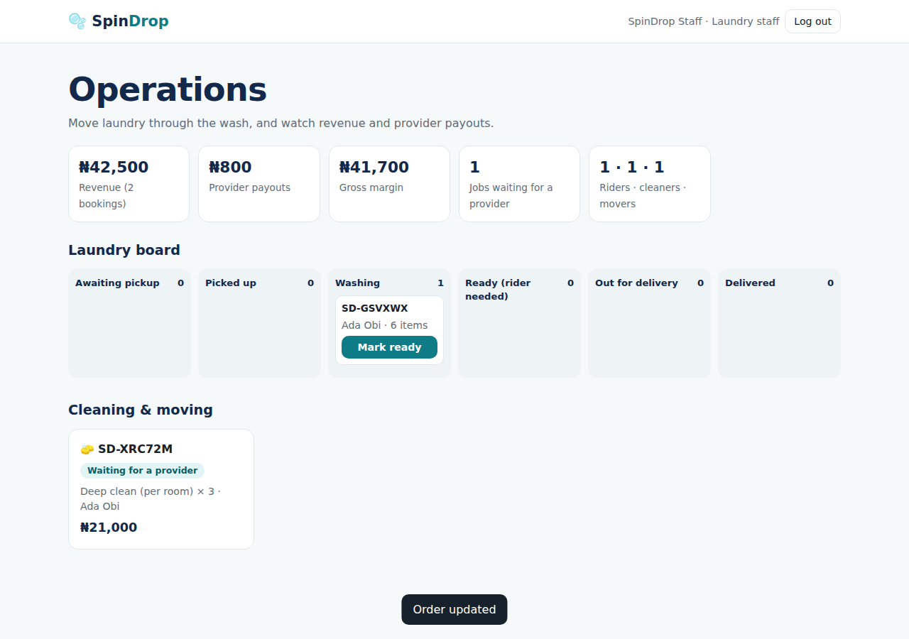
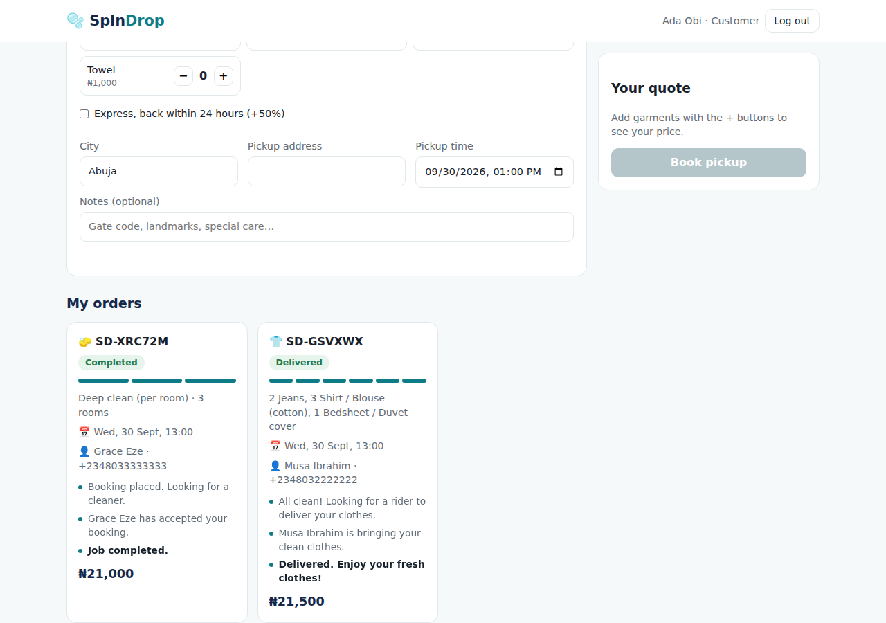

# 🫧 SpinDrop: Laundry Logistics, Cleaners & Movers

**Laundry picked up, washed and delivered.** SpinDrop is a laundromat that is also a logistics company. Customers price their laundry **by garment type**, a **rider** collects it, the laundry staff wash it, and a rider brings it back. The same platform books **home cleaners** and **movers**, who sign up and accept jobs near them.

> **Live demo:** _add your deployed link here_ · Demo logins (password `Password123!`): `ada@demo.ng` customer · `musa@demo.ng` rider · `grace@demo.ng` cleaner · `kunle@demo.ng` mover · `admin@spindrop.ng` laundry staff



## How it works

| Service | Flow |
|---|---|
| 👕 **Laundry** | Customer picks garments → **rider pickup job** → rider collects → staff: *washing* → *ready* → **rider delivery job** is created → rider delivers |
| 🧽 **Home cleaning** | Customer books by type and number of rooms → a **cleaner** accepts → completes |
| 🚚 **Moving** | Customer books by move size with from/to addresses → a **mover** accepts → completes |

**Pricing (sample):** Jeans ₦5,000 · cotton shirt/skirt/trousers ₦2,000 · T-shirt ₦1,500 · suit ₦7,000 · agbada ₦8,000 · duvet ₦6,000 … pickup and delivery ₦2,000, express (24h) +50%. Cleaning ₦4,000/room (standard) or ₦7,000/room (deep). Moving from ₦15,000 (a few items) to ₦140,000 (3-bedroom).

## Features

- **Five roles** with their own dashboards: customer, rider, cleaner, mover and laundry staff (admin). Admin accounts can't be self-registered.
- **Live quotes:** the same server-side pricing function powers the on-screen quote and the saved booking, so customers always pay what they were shown.
- **Job marketplace for providers:** open jobs are shown by role and city. Accepting uses row locking so **two riders can never grab the same job**. The full address and customer phone are only revealed after accepting.
- **Laundry pipeline board** for staff (awaiting pickup → picked up → washing → ready → out for delivery → delivered). Marking an order "ready" automatically creates the delivery job.
- **Tracking timeline** for customers ("Musa is on the way to pick up your clothes…"), with the provider's name and phone.
- **Earnings and payouts:** riders earn ₦800 per trip; cleaners and movers keep 80%. The admin dashboard shows revenue, provider payouts and gross margin.
- **Cancellation rules:** customers can cancel only until a provider takes the first job.
- Price snapshots on order items, money in kobo, reference numbers like `SD-GSVXWX`.

## Screenshots

| Book laundry with live quote | Rider jobs | Staff laundry board | Customer tracking |
|---|---|---|---|
|  |  |  |  |

## Tech stack

Node.js 22 · Express 5 · MySQL 8 · JWT + bcrypt authentication · vanilla JavaScript · Jest + Supertest · Docker · GitHub Actions

## Data model

`users` (5 roles) · `garment_types` (price list) · `service_options` (cleaning/moving prices) · `bookings` · `laundry_items` (price snapshots) · `jobs` (pickup, delivery, cleaning and moving work offered to providers) · `booking_events` (tracking timeline)

## API overview

| Method | Endpoint | Who |
|---|---|---|
| POST | `/api/auth/register` · `/api/auth/login` · GET `/api/me` | anyone / logged in |
| GET | `/api/pricing` · POST `/api/quote/:type` | anyone |
| POST | `/api/bookings/laundry` · `/cleaning` · `/moving` | customer |
| GET | `/api/bookings` · `/api/bookings/:id` · POST `/api/bookings/:id/cancel` | customer |
| GET | `/api/jobs/available` · `/api/jobs/mine` · `/api/earnings` | rider / cleaner / mover |
| POST | `/api/jobs/:id/accept` · `/api/jobs/:id/complete` | rider / cleaner / mover |
| GET | `/api/admin/summary` · `/api/admin/bookings` · PATCH `/api/admin/bookings/:id/status` | laundry staff |

## Tests

**17 integration tests** against a real MySQL database: pricing and quotes (including express), permissions for every role, the complete laundry journey (order → pickup → washing → ready → delivery → timeline → rider earnings), cleaning and moving flows, cancellation rules, past-date validation and the admin revenue summary.

## Run it locally

```bash
cd web-development-portfolio/03-spindrop
npm install
cp .env.example .env      # set DB_USER / DB_PASSWORD
npm run dev               # creates the database on first start
npm test
```
Or `docker compose up --build`.

## Built with

Built with **AI-assisted development (Claude Code)**, then reviewed, run and tested. Next steps: Paystack payments, live rider location, SMS/WhatsApp notifications and photo proof of pickup and delivery.

Part of my [web development portfolio](../README.md) · **Favour Oghale**
