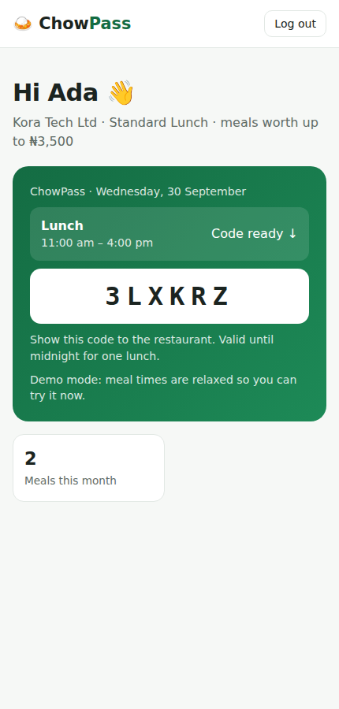
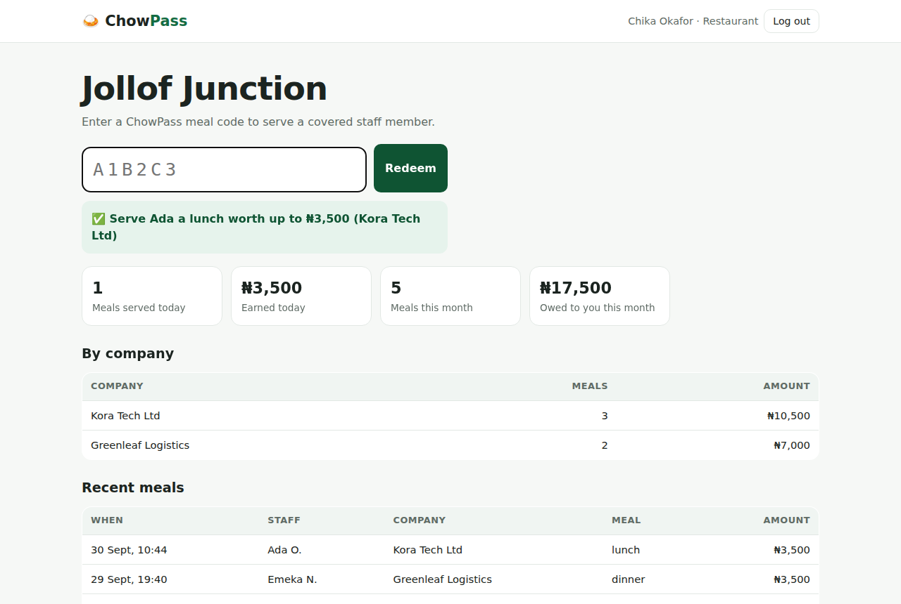
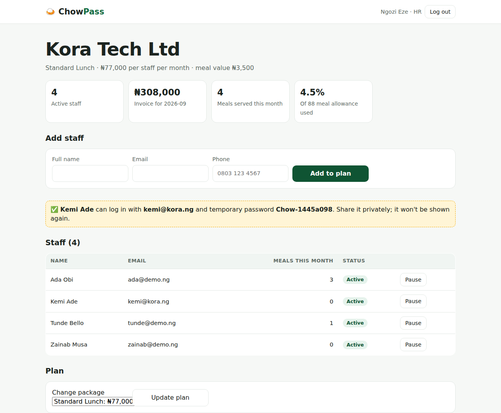
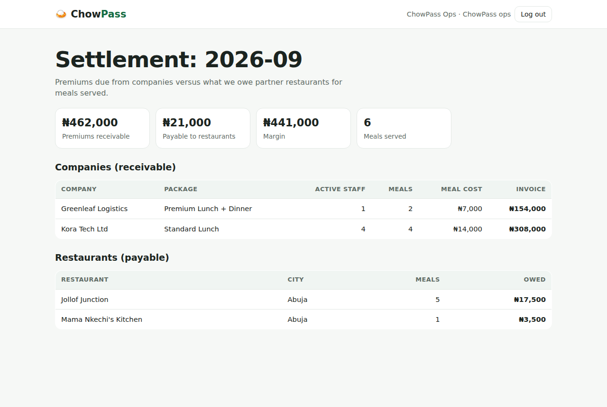

# 🍛 ChowPass: Staff Meal Benefits, Run Like an HMO

**Free staff lunches, handled.** ChowPass lets companies give employees daily meals the way HMOs handle healthcare. The company pays a **fixed monthly premium per staff member**, staff get a **one-time meal code** at mealtimes, and **partner restaurants** are paid a fixed amount for every meal they serve.

> **Live demo:** _add your deployed link here_ · Demo logins (password `Password123!`): `ada@demo.ng` staff · `kitchen@demo.ng` restaurant · `hr@demo.ng` HR · `admin@chowpass.ng` ChowPass operations


## The model

| Package | Covers | Meal value (paid to restaurant) | Premium (paid by company) |
|---|---|---|---|
| Basic Lunch | 1 lunch / working day | ₦2,500 | ₦55,000 per staff / month |
| Standard Lunch | 1 lunch / working day | ₦3,500 | ₦77,000 per staff / month |
| Premium Lunch + Dinner | lunch **and** dinner | ₦3,500 each | ₦154,000 per staff / month |

Premium = 22 working days × meals per day × meal value. As with an HMO, ChowPass keeps the difference between premiums collected and meals actually served.

## Four dashboards

- **🙋 Staff** (mobile-first): today's meals, a big **6-character meal code** during the lunch window (11:00 am–4:00 pm) or the dinner window (5:00–9:00 pm, Premium only), the restaurant where each meal was redeemed, and meals this month.
- **🍲 Restaurant:** enter a code to redeem it ("Serve Ada a lunch worth up to ₦3,500"), with meals and earnings today, **amount owed this month**, a breakdown by company and recent meals.
- **🏢 HR:** active staff, **this month's invoice** (active staff × premium), meals served and utilisation of the meal allowance. HR can add staff (a one-time temporary password is generated), pause or reactivate staff, and change package.
- **📊 ChowPass operations:** monthly **settlement** showing premiums receivable per company, amounts payable per restaurant, and margin.

## Rules the system enforces

- One code per staff member per meal per day. Asking again returns the same code, and after eating you can't get another.
- Codes only work inside the meal window and **expire** when it closes (Lagos time, UTC+1).
- Dinner is only available on packages that include it.
- A code can be redeemed **once**. Row locking prevents two restaurants redeeming it at the same moment.
- Paused staff can't log in or get codes; HR can only manage their own company's staff.
- The meal value is saved on each redemption, so changing package later doesn't rewrite past settlements.

## Screenshots

| Staff meal code | Restaurant redeem | HR dashboard | Settlement |
|---|---|---|---|
|  |  |  |  |

## Tech stack

Node.js 22 · Express 5 · MySQL 8 · JWT + bcrypt · vanilla JavaScript · Jest + Supertest · Docker · GitHub Actions

## Engineering highlights

- **Time-aware business logic:** a small injectable clock (`src/utils/clock.js`) converts to Lagos time, so tests can "freeze" time at 8:00 am, 12:30 pm, 4:05 pm or 6:30 pm to prove the meal windows, expiry and dinner rules.
- **Database constraints as a safety net:** `UNIQUE (staff_id, meal_date, meal_type)` guarantees one meal per sitting even under race conditions.
- **Multi-tenant access control:** staff and HR are scoped to their company, and restaurants to their restaurant, looked up from the database rather than trusted from the token.
- **Demo mode** (`ALLOW_ANYTIME_MEALS=true`) relaxes meal times so visitors to the live demo can try the flow at any hour.
- **16 integration tests** covering packages, sign-up, roles, code generation, redemption, double-use, expiry, dinner rules, HR staff management, cross-company isolation and settlement totals.

## API overview

| Method | Endpoint | Who |
|---|---|---|
| GET | `/api/packages` | anyone |
| POST | `/api/auth/register-company` · `/api/auth/register-restaurant` · `/api/auth/login` · GET `/api/me` | anyone / logged in |
| GET | `/api/staff/today` · POST `/api/staff/code` | staff |
| POST | `/api/restaurant/redeem` · GET `/api/restaurant/overview?month=` | restaurant |
| GET | `/api/hr/overview?month=` · `/api/hr/staff` · POST `/api/hr/staff` · PATCH `/api/hr/staff/:id` · PATCH `/api/hr/package` | HR |
| GET | `/api/admin/overview?month=` | ChowPass operations |

## Run it locally

```bash
cd web-development-portfolio/04-chowpass
npm install
cp .env.example .env      # set DB_USER / DB_PASSWORD (and ALLOW_ANYTIME_MEALS=true to try it any time)
npm run dev
npm test
```
Or `docker compose up --build`.

## Built with

Built with **AI-assisted development (Claude Code)**, then reviewed, run and tested. Next steps: automated monthly invoices and restaurant payouts via Paystack, QR codes as an alternative to typed codes, per-company restaurant lists and meal-value top-ups.

Part of my [web development portfolio](../README.md) · **Favour Oghale**
