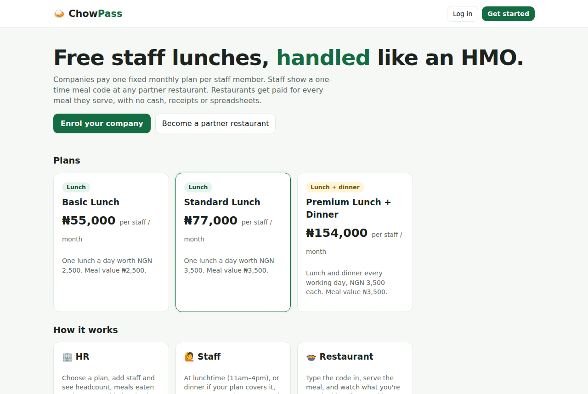

# Web Development Portfolio

Hi, I'm **Favour Oghale**, a Computer Science graduate (Second Class Upper) who builds practical web applications with **Node.js, Express, MySQL and JavaScript**. I use **AI-assisted development (Claude Code)** to move fast, and I review, test and understand every line.

Every project has its own folder, README, setup instructions, automated tests, screenshots and Docker setup, and each one runs its own GitHub Actions CI.

## Projects

| # | Project | What it is | Highlights | Live demo |
|---|---|---|---|---|
| 01 | [🛒 Foodstuff Store](01-foodstuff-store/) | An online grocery shop | Catalogue, cart, **transactional checkout** with stock locking, order tracking, admin API · 22 tests | [Open demo](https://foodstuff-store.onrender.com) |
| 02 | [⚡ Urgent2k](02-urgent2k/) | A TaskRabbit for Nigerians, connecting people with local taskers for errands and odd jobs | Two-sided marketplace, offers, **escrow-style payments** with a 10% fee, reviews and ratings, privacy of addresses · 16 tests | [Open demo](https://urgent2k-eej5.onrender.com) |
| 03 | [🧺 SpinDrop](03-spindrop/) | Laundry plus logistics: riders, home cleaners and movers | **Per-garment pricing** (jeans ₦5,000, shirts ₦2,000…), pickup and delivery jobs for riders, cleaners and movers who sign up, admin board with revenue and payouts · 17 tests | [Open demo](https://spindrop.onrender.com) |
| 04 | [🍛 ChowPass](04-chowpass/) | Staff meal benefits run like an HMO | Fixed-price packages, one-time **meal codes** (lunch, plus dinner if the company pays for it), staff, HR, restaurant and operations dashboards, monthly settlement · 16 tests | [Open demo](https://chowpass.onrender.com) |

**71 automated integration tests** across the four apps run on every push.

| Foodstuff Store | Urgent2k |
|---|---|
|  |  |
| **SpinDrop** | **ChowPass** |
|  |  |

## Skills demonstrated

- **Back end:** REST API design, Express middleware, input validation, consistent error handling, JWT authentication with role-based access (customers, taskers, riders, HR, restaurants, admins), API-key auth
- **Databases:** MySQL schema design, foreign keys, indexes and unique constraints, **transactions and row locking** to prevent double-booking and double-spending, money stored in kobo, price snapshots so history never changes
- **Business logic:** order and job **status workflows**, platform fees and payouts, time-window rules (meal codes that expire), multi-tenant data isolation
- **Front end:** responsive, mobile-first HTML/CSS and vanilla JavaScript single-page dashboards talking to a REST API
- **Quality and DevOps:** integration testing (Jest + Supertest), GitHub Actions CI, Docker and docker-compose, one-click cloud deployment with a Render Blueprint (`render.yaml`), health checks
- **Ways of working:** small, clear commits, documentation, AI-assisted development with Claude Code

## Run any project locally

```bash
cd web-development-portfolio/02-urgent2k   # or any project folder
npm install
cp .env.example .env                        # add your MySQL username and password
npm run dev
```

Each project creates its own database and demo data on first start. Demo logins are listed in each README.

## Other work

- 📊 [Data Analytics Portfolio](https://github.com/oghenefavour/data-analytics-portfolio): Excel, Power BI, SQL and a Python PDF-to-Excel automation tool
- 🗂️ [Virtual Assistant Portfolio](https://oghenefavour.github.io/Virtual-Assistant-Portofolio/)
- 💼 [LinkedIn](https://www.linkedin.com/in/favour-oghale-8769a9283/)
